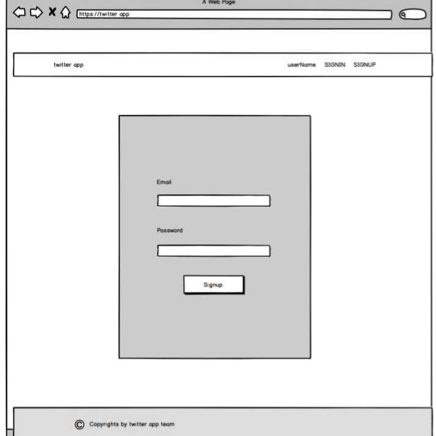
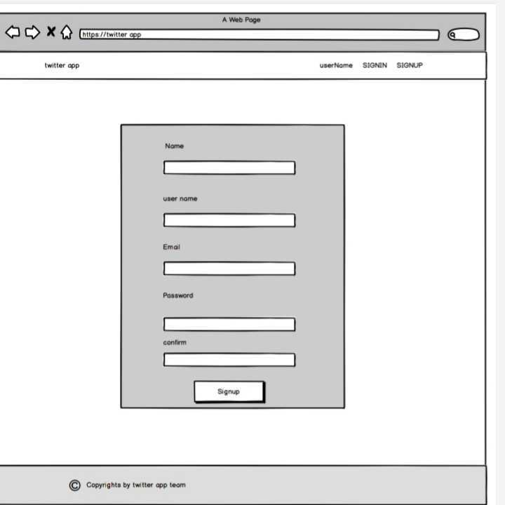
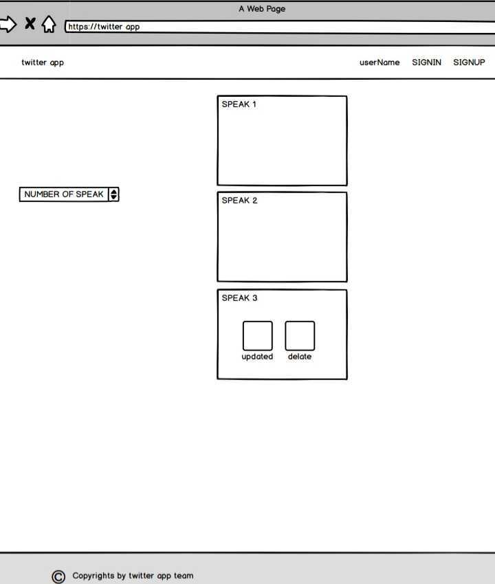

# README

This README would normally document whatever steps are necessary to get the
application up and running.

Things you may want to cover:

  ## Project-4-Full-Stack-Application
## How to vist our app
open     on your browser
## How to create account 
click on sign up on top of page
=======
# Project-4 simulators twitter App

## Project Overview
 we try to  make app similar to twitter app
Our main intention is to make app for easy platform connected between people 
## Prototype
 
 
 

## Software Requirements
twitter App  is built using ruby on rails (SQL database) . 
## User requirements
 1. User can be able to sign up
 2. User can be able to sign in
 3. User can be able to change password
4. User can be able to sign out
5. User can be able to make tweet 
6. User can be able to edit a tweet and  able to delete
# future work :
 1. make private chat 
 2. update style of app 
 3. make authentication of password
 4. make follow function
 5. activate trends 
## Team Member
Faisal Buzaid
 Adel Hazazi
 mohamed alhaddad

